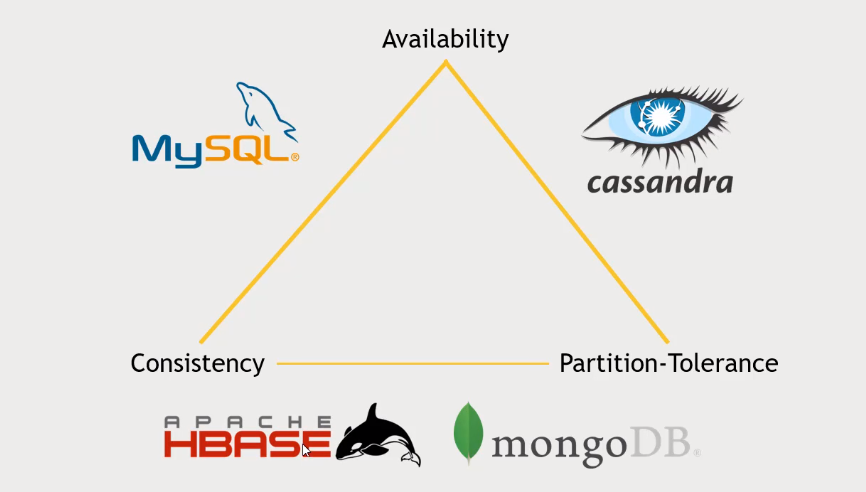

# **HADOOP**

Algunas notas rápidas de mi hands-on de Hadoop.

## Fundamentos

Hadoop es una framework para BigData. Permite tanto almacenamiento como procesamiento distribuido


## **1. MapReduce**

Es uno de los fundamentos de Hadoop. Se programa en Java, aunque desde Python es posible invocarlo usando Streaming.

Sin embargo, desarrollar código en MapReduce obliga a pensar cada tarea en términos de mappers y reducers, lo cual no es práctico. Por lo tanto, se han desarrollado herramientas que detrás usan MapReduce o mejoras a éste. Por ejemplo, Pig, Hive, Impala, Spark... todas ellas tienen detrás un buen uso de procesamiento distribuido.

## **2. Pig**

Es precisamente una plataforma para prograrmar MapReduce pero en alto nivel, en un lenguaje similar a SQL llamado *Pig Latin*.

Ejemplo:
```pig
ratings = LOAD '/user/maria_dev/ml-100k/u.data' AS (userID:int, movieID:int, rating:int, ratingTime:int);

metadata = 	LOAD '/user/maria_dev/ml-100k/u.item' USING PigStorage('|')
			AS (movieID:int, movieTitle:chararray, releaseDate:chararray, videoRelease:chararray, imbdLink:chararray);
            
nameLookup = FOREACH metadata GENERATE 	movieID, movieTitle, releaseDate;
                                        
ratingsByMovie = GROUP ratings BY movieID;

avgRatings = FOREACH ratingsByMovie GENERATE group AS movieID, AVG(ratings.rating) AS avgRating, COUNT(ratings.userID) AS numRatings;
```

## **3. Spark**

Realiza procesamiento MapReduce, pero teniendo sus datos en memoria, lo cual lo hace muy rápido.

Con Spark 2.0 se empezó a hablar de datasets. Se crearon varias librerías sobre Spark.

- Spark Streaming: se puede, e.g., insertar datos en tiempo real
- Spark SQL: interfaz SQL para Spark, para transformar y escribir datos. Hoy se ha enfocado mucho el trabajo para que esto sea muy óptimo.
- MLLib: librería para realizar Machine Learning y Data Mining.
- GraphX: para trabajo sobre grafos.

Está hecho en lenguaje Scala, que se trasnforma en bytecodes de Java. También se puede programar en Python, aunque es más lento e intestable.

### **3.1. RDDs**
El Core de Spark se planteó sobre el concepto de RDDs: Resilient Distributed Dataset. Como su nombre lo indica, permite tener un dataset de manera distribuida en el clúster y resiliente ante fallos.

Para lograrlo, se debe tener un SparkContext. Por defecto, el shell de Spark lo crea con el nombre ***sc*** en el *driver program*.


En Spark se pueden crear RDDs desde múltiples fuentes: paralleliza (crea en código), archivos planos, archivos en HDFS, AWS, Hive, JDBC, Cassandra, HBase, Elastisearch, archivos JSON, CSV, etc.

Los RDDs se pueden transformar con funciones como las siguientes:
```
- map:      Relaciones 1 a 1. Toma cada fila y la transforma según la función.
- flatmap:  Aumenta o disminuye el resultado según lo indicado.
- filter:   Sólo deja los que cumplan una condición.
- distinct: Valores únicos
- sample:   Toma una muestra aleatoria
- union, intersection, subtract, cartesian: Según lo requerido
```

Por ejemplo [en Python]:
```python
rdd = sc.parallelize([1, 2, 3, 4])
squareRDD = rdd.map(lambda x: x*x)
```

También se pueden transformar con las siguientes **acciones**:
```
- collect:  Así como el "map", este es como el "reduce". Trae el resultado a memoria.
- count
- countByValue
- take:     Muestra el fragmento que uno desee, como el LIMIT.
- top:      Igual que el take
- reduce:   Reduce, combina todos los valores de acuerdo con una llave.
- reduceByKey
... etc.
```

Spark no ejecuta nada, a menos que se le indique alguna **acción**. Por eso se dice que es de "lazy evaluation".

### **3.2. Dataframes**
Los *RDDs* pueden contener cualquier información. Los DataFrames son una extensión de los RDDs con las siguientes características:
- Contienen objetos tipo fila (Row)
- Pueden ejecutar consultas SQL
- Tienen una estructura, un esquema, i.e., columnas con nombre y tipo de dato (almacenamiento más eficiente)
- Se pueden leer/escribir en JSON, Hive, Parquet
- Se pueden comunicar con JDBC/ODBC, Tableau, etc.

### **3.3. Datasets**

Un DataFrame es un DataSet con objetos tipo fila (Row). Es decir, un DataSet es algo más genérico, puede contener cualquier clase de información tipada, no necesariamente tipo fila.

En Python no se ve esto fácilmente, por ser un lenguaje de tipado dinámico.

> Nota

Es posible crear un servidor de base de datos usando SparkSQL
Iniciar el servidor:
```bash
sbin/start-thriftserver.sh
```
Conectar:
```bash
bin/beeline -u jdbc:hive2://localhost:10000
```
Usar:
```python
hiveCtx.cacheTable("tableName")
```

Incluso, se pueden desde allí definir funciones propias (UDF's) y usarlas en SQL.
```python
from pyspark.sql.types import IntegerType

hiveCtx.registarFunction("square", lambda x: x*x, IntegerType())
df = hiveCtx.sql("SELECT square('someNumericField') FROM tableName)
```

### **3.4. SparkSession**
Es nuevo para la versión 2.0. ¡Contiene el mismo SparkContext más el SQLContext!

```python
from pyspark.sql import SparkSession

spark = SparkSession.builder.appName("PopularMovies").getOrCreate()
```

### **3.5 MLLib**
Ésta y otras librerías se pueden usar. Por ejemplo, algoritmos de recomendación.
```python
from pyspark.ml.recommendation import ALS
als = ALS(maxIter=5, regParam=0.01, userCol="userID", itemCol="movieID", ratingCol="rating")
model = als.fit(ratings)
recommendations = model.transform(popularMovies)
```

## **4. Hive**
Opera traduciento sentencias SQL en comandos MapReduce o Tez, dependiendo de cuál se elija, permitiendo procesar en todo el clúster con datos almacenados a lo largo de todo el mismo clúster.
Se realizan consultas OLAP más facilmente que si se hicieran en MapReduce con Java. Bien para OLAP (OnLine Analityc Processing), no para OLTP (OnLine Transaction Processing), ya que tiene alta latencia.
Son archivos planos, datos almacenados de forma desnormalizada, no es una base de datos relacional.
Es altamente optimizado y extendible (UDFs, Thrift server, JDBC/ODBC driver)

### **4.1. Almacenamiento**
*Schema On Read*
Hive puede acoplar a una estructura definida mientras lee un archivo. Es decir, no es *Schema on Write* como la mayoría de SGBD, sino que procesa los archivos de entrada con base en una estructura  (metastore) definida a la cual adapta los datos.
```sql
-- Define la estructura (metastore)
CREATE TABLE ratings(
    userID INT,
    movieID INT,
    rating INT
)
RO FORMAT DELIMITED
FIELDS TERMINATED BY '\t'
STORED AS TEXTFILE;

-- Schema on read, adapta el archivo con la estructura definida
LOAD DATA LOCAL INPATH '${env:HOME}/ml-100k/u.data'
OVERWRITE INTO TABLE ratings;
```

Con **HCatalog** se puede exponer el esquema a otros servicios.

Se tienen tablas:
+ Managed: Hive toma el control, se vuelve el propietario de la tabla. Pueden ser de dos formas:
(i)  LOAD DATA: Mueve los datos de HDFS a Hive. Si se borra la tabla en Hive, desaparece del HDFS.
(ii) LOAD DATA LOCAL: Copia los datos de tu sistema local de archivos a Hive.

+ External: Crea un metastore, con base en la ruta en HDFS especificada. Si se borra la tabla, no se borran los datos.

### **4.2. Particiones**
Es posible almacenar los datos en subdirectorios particionados. Permite una grandísima optimización de las consultas.

### **4.3. Datos complejos**
Hive no se limita a los tipos de datos simples (int, string, etc.). También tiene estucturas de datos como el STRUCT o el MAP. Ej:
```sql
CREATE TABLE customers (
    name STRING,
    address STRUCT<street:STRING, city:STRING, state:STRING, zip:NIT>
)
PATITIONED BY (country STRING);
```

### **4.4. Formas de usar Hive**

+ Vía interactiva *hive> prompt* / Command line interface (CLI)
+ Archivos de consulta guardados: *hive -f /sompath/queries.hql*
+ De forma gráfica con Ambari / Hue
+ A través de un servidor JDBC / ODBC
+ Con un servicio Thrift (ojo, Hive no es para OLTP)
+ Vía Oozie

## **5. Sqoop**
SQL + Hadoop => Sqoop

Usa MapReduce para manejar la importación y exporación de datos.
Puede llevar datos de sistemas relacionales a distribuidos.

MySQL / PostGres / etc.     >>>===>>>      Mapper|Mapper|Mapper        ===>     HDFS

Sqoop funciona por líneas de comandos, por lo que puede ejecutarse con un script, un cron, o Oozie.

Ej.
```bash
# Al final, hive-import es para que no sólo lo deje en HDFS sino que lo deje expuesto para ser consultado como tabla Hive
sqoop import --connect jdbc:mysql://localhost/movielens --driver com.mysql.jdbc.Driver --table movies --hive-import

# Se pueden hacer ingestiones incrementales
# También agregar varios parámetros como:
--check-column
# para agregar un timestamp o sequenceNumber que permita identificar la ingestión
# O también:
--last-value
# para saber desde dónde empezar la siguiente ingestión, por ejemplo

```

También se pueden exportar datos de Hive para MySQL, por ejemplo.

```bash
# El -m 1 es la cantidad de mappers. En este caso sólo es 1, ya que estamos trabajando en una máquina virtual (1 PC, 1 host)
# La dirección del driver no es obligatoria, hay una por defecto, pero se especifica para estar más seguros
# exported_movies es el nombre de la tabla como quedaría en MySQL. Se debe garantizar que exista allí previamente con las mismas propiedades de columnas.
# Luego se le indica la ruta donde se encuenta en el HDFS el archivo a exportar (export-dir) que en Hortonworks es /apps/hive/warehouse. En otras distribuciones, en vez de "apps" puede ser "user".
# Finalmente se especifica cómo se encuentran separados los campos, que, por defecto, es el código ASCII 1.
sqoop export --connect jdbc:mysql://localhost/movielens -m 1 --driver com.mysql.jdbc.Driver --table exported_movies --export-dir /apps/hive/warehosue/movies --input-fields-terminated-by '\0001'
```
> Nota: La herramienta adecuada para la tarea adecuada. En MySQL el ejercicio de la película más popular tuvo resultados en 0.1 segundos. Como es una base de datos tan pequeña, MySQL arroja rápidamente los resultados.

## **6. NoSQL**
Los sistemas de bases de datos relacionales (RDBM) se quedan cortos para grandes bases de datos masivas, horizontalmente escalables (es decir, que se puedan ir agregando discos para mayor capacidad, sin necesidad de hacer cambios a lo que ya hay), y que puedan ser consultados de forma rápida y resiliente. Para ello nació NoSQL.

### **6.1. HBase**
Es una base de datos no relacional (NoSQL) escalable, construida sobre HDFS. Así, es un sistema que permite realizar consultas rápidas sobre bases de datos masivas; expone big data para servicios web, aplicaciones web y otros que demanden operación rápida y a muy gran escala.

Se basa en la arquitectura BigTable propuesta por Google.

Muchos datos, y muchas peticiones requieren una plataforma como HBase. Otras formas de hacerlo (anteriormente) serían:
1. Denormalizar las tablas: si está regada la información en varias tablas, generar una que contenga los datos que más se requieran, sin necedidad de estar cruzando en estas bases tan grandes.
2. Crear capas de hagan caché de la información más relevante.
3. Configuraciones maestro-esclavo que permitan tener varias bases de datos, unas para escritura, otras para lectura... Requiere buen DBA.
4. Sharding requiere agrear capacidad, y no siempre es fácil. Consiste en agregar particiones horizontales.
5. Crear vistas marelializadas.
6. Eliminar Stored Procedures.

Como es NoSQL, no tiene un lenguaje de consultas, pero tiene una API que permite realizar operaciones CRUD.

HBase funciona almacenando en distintos *Region Servers*, que son *shards* o particiones que él automáticamente hace para agrupar llaves. Incluso aumentando los servidores, automáticamente distribuye los datos en ellos. También tiene un *HMaster* que conoce el esquema de los datos y las particiones; y *ZooKeeper* para direccionar en caso de falla de algún nodo.


Modelo de datos de HBase:
+ Cada fila tiene una clave única (i.e. PK).
+ Cada fila tiene un pequeño número de *familias de columnas*.
+ Una *familia de columnas* puede contener muchas columnas, incluso arbitrarias.
+ Cada celda puede tener varias *versiones* de acuerdo con un timestamp dado.
+ No hay problema con tener muchas columnas vacías (sparse data), para HBase no consumen espacio.

El gran poder de HBase es que es orientado a filas. Es importante pensar cuáles son aquellas consultas que se necesitan, que se requieren con mayor frecuencia, para construir tablas con base en ese resultado.

Formas de acceder a HBase:
+ HBase shell
+ Java API, aunque también hay wrappers para Python, Scala, y otros
+ Spark, Hive, Pig: para lectura y escritura de datos.
+ REST service: fácil de usar.
+ Thrift service: transmite más rápida y eficientemente, debido a que almacena los datos en una forma binaria. Sin embargo, los cambios en versiones pueden complicar mucho la compatibilidad.
+ Avro service: transmite más rápida y eficientemente, debido a que almacena los datos en una forma binaria. Sin embargo, los cambios en versiones pueden complicar mucho la compatibilidad.

El sugerido es REST, por su facilidad; pero si se desea más eficiencia, Thrift o Avro son buenas alternativas.

Para iniciar HBase, se puede hacer desde Ambari. Sin embargo, para iniciar el servicio REST para HBase, se usa un comando como el siguiente, después de haber definido el puerto (agregándolo a la configuración de la VM):
```bash
/usr/hdp/current/hbase-master/bin/hbase-daemon.sh start rest -p 8000 --infoport 8001

# Para terminarlo:
/usr/hdp/current/hbase-master/bin/hbase-daemon.sh stop rest
```

[Ejemplo usando REST](hbase/restClientForHBase.py): Desde Python se conecta al servidor REST. Transforma .data en tabla HBase. Pero es pequeña.

Para tablas grandes (que no quepan en disco, por decir algo), almacenadas en el HDFS, se puede usar Pig, o incluso "importtsv".

Con Pig la primera columna debe ser la clave primaria. 

Ejemplo:
1. Crear la tabla en HBase
```bash
# Iniciar HBase
hbase shell

# Ver las tablas existentes
> list

# Crear tabla "users" con la familia de columnas "userinfo"
> create 'users', 'userinfo'

# Creada la tabla, se puede salir
> exit
```
2. Insertar los datos usando Pig

[Ejemplo usando Pig](hbase/hbase.pig)

3. Validar la inserción de los datos.
```bash
hbase shell

# Para ver lo que contiene la tabla
> scan 'users'

# Antes de tumbarla, primero hay que deshabiiltarla.
> disable 'users'
> drop 'users'
```

### **6.2. Cassandra**
Es un sistema de base de datos distribuida pensado en alta disponibilidad, "no single point of failure". Diseñado, como HBase, para transacciones masivas y de alta escalabilidad.

No tiene un nodo maestro como HBase, de hecho, cada nodo ejecuta exactamente el mismo software y desempeña las mismas funciones.

El modelo de datos es similar a BigTable / HBase. Y aunque es no-relacional, tiene un lenguaje de consulta *CQL*.

*CQL* no permite joins (datos deben ser denormalizados, ¡es NoSQL!), y todas las consultas deben hacerse sobre claves primarias. CQL es más pensado como una API para lectura/escritura con bases de datos NoSQL.

> Teorema CAP: Sólo puedes tener 2 de 3 entre: consistencia, disponibilidad y tolerancia-a-particiones. Para Big-Data, es elemental la tolerancia-a-particiones. Sólo queda escoger entre disponibilidad y consistencia.

Cassandra prefiere disponibilidad a la consistencia (aunque sí tiene "eventual consistency"). Así, puede tomar unos segundos para efectuar cambios. Con mayor consistencia, por ejemplo, con MongoDB o HBase, se tiene un nodo maestro que la garantiza; pero si éste se cae (e.g. se puede caer hasta el ZooKeeper en Hadoop), se jodió todo. En cambio, la arquitectura de Cassandra no tiene nodo maestro, sino que todos saben todo, y si un nodo se cae, los otros nodos saben con cuál otro seguir. La falta de consistencia mostrará, en el peor de los casos, e.g., un dato viejo, no el más reciente, pero siempre tendrá una respuesta... y en big data a veces no afecta mucho un dato anterior (digamos, la publicación más reciente en Facebook, no pasa nada si tarda unos segundos en aparecer). Dependerá de la necesidad.

De todos modos, se puede indicar a Cassandra si se requiere mayor consistencia. Por eso se dice que tiene "tunable consistency".



Cassandra opera con los nodos en topología de anillo. Entre ellos se comunican y se informan dónde está la información. No hay nodo maestro.

Es posible tener varios racks de Cassandra, así un anillo se enfoca, e.g., a las consultas desde la web para los usuarios externos; y otro para analítica interna desde Hadoop.

Por ejemplo, con Spark se comunica muy bien usando *DataStax*: las tablas de Cassandra se leen como DataFrames! Así, se puede usar para modelos analíticos, pero también ¡para transformar datos y almacenarlos en Cassandra para uso transaccional!

> Las bases de datos se llaman "keyspace" en Cassandra. Pero es lo mismo: un conjunto de tablas.

Ejemplo, después de instalado e iniciado, en CQLSH:
```sql
CREATE KEYSPACE movielens WITH replication={'class':'SimpleStrategy', 'replication_factor':'1'} AND durable_writes = true;
USE movielens;
CREATE TABLE users (user_id int, age int, gender text, occupation text, zip text, PRIMARY KEY (user_id));
```
[Ejemplo usando PySpark para conectarse a Cassandra](cassandra/CassandraSpark.py)

### **6.3. MongoDB**
Es un sistema de base de datos distribuida orientado a la consistencia.

El modelo de datos es orientado a documentos, por lo que se almacena como JSONs; así, se pueden tener incluso distintos campos en cada documento. Tiene alta flexibilidad en la forma en que se almacena, lo cual es bueno, pero debe tratarse con cuidado (i.e., tratar siempre de denormalizar los datos).

No es necesario tener un campo como clave primaria, aunque sí se pueden crear índices, en especial para hacer sharding (particionamiento).

Por defecto, MongoDB crea un _id como identificador de cada documento.

Terminología MongoDB: Documentos \subseteq Colección \subseteq Base de datos
Así, no se habla de tablas y filas, ya que no en Mongo no se tiene una estructura definida, si no de Documentos en Colecciones.

MongoDB tiene un único nodo maestro. Algo positivo es que mantiene copias secundarias de los datos, de forma tal que si se cae el principal, puede consultar la información en alguno de los nodos secundarios (*replica sets*). [Esto no es BigData propiamente, es simplemente durabilidad y disponibilidad de la información en un SGBD].

La parte de BigData es que Mongo, para cada proceso en el servidor de aplicaciones (frontend), tiene un servicio "mongos" que se pega de tres servidores de configuración. Estos le dicen en cuál *shard* (partición) está la información, además de balancear los shards para almacenar la información equilibradamente en las particiones.

*Caprichos de Mongo*:
- Se debe definir un servidor primario. Si hay cantidad par de servidores, toca tener otro, o al menos nombrar un nodo árbitro (pero sólo 1).
- Las aplicaciones deben conocer todo sobre los servidores réplica. Si hay adiciones o cambios, se debe actualizar la información.
- Si se cae un nodo, los *replica sets* pueden usarse, pero sólo en modo lectura; hasta que no se defina un nodo principal.
- No hace autosharding.

*Cosas chéveres de Mongo*:
+ Puedes retardar las copias a servidores secundarios. Así, si la embarras, podés restaurar desde la copia.
+ El shell es intérprete de JavaScript
+ Muy bueno con índices, en especial, para texto y para bd geográficas.
+ Es parecido a Hadoop! Puedes trabajar con MapReduce, tiene un propio sistema de archivos distribuidos (GridFS).
+ Tiene un SQL connector.

Para correr Mongo, se agrega el servicio en /var/lib/ambari-server/resourses/stacks/services. Luego se puede agregar el servicio desde Amabari. Y desde la terminal, se puede ejecutar el PySpark, indicándole dónde encuentra la librería para MongoDB.
```bash
spark-submit --packages org.mongodb.spark:mongo-spark-connector_2.11:2.0.0 MongoSpark.py
```

[Ejemplo usando PySpark para conectarse a MongoDB](mongo/MongoSpark.py)

Para entrar al shell de MongoDB, tan sólo es ejecutar "mongo". Allí, se pueden hacer consultas usando JavaScript. Por ejemplo:
```javascript
/* Busca los registros que tengan user_id = 100*/
db.users.find( {user_id: 100 } )

/* Mostrar el plan de ejecución. Se nota que el plan es consultar registro
a registro (scan) hasta encontrar los que cumplan con el filtro.*/
db.users.explain().find({user_id: 100})

/*  Por eso, se sugiere hacer un índice sobre esta columna. En Cassandra se hace automáticamente sobre la clave primaria. En Mongo debe especificarse*/
/* Se indica el nombre de la columna (user_id), y el 1 indica que es de forma ascendente.*/
db.users.createIndex( {user_id: 1} ) 

/*  Promedio de edad por ocupación.
    el $ es para indicar alguna función o variable en mongo
    _id para que lo haga a cada documento
    occupation será el campo por el que agrupará
    y $avg es la función promedio, que aplicará sobre el campo $age */
db.users.aggregate([ { $group: { _id: { occupation: "$occupation"}, avgAge: { $avg: "$age" } } } ])

/*  Cantidad de usuarios */
db.users.count()

/*  Listar colecciones en la db */
db.getCollectionInfos()

/*  Tumbar documento */
db.users.drop()

```

> **OJO**: Apagar bien Mongo. Ir a Ambari y parar el servicio.

### **¿Cuál sistema de base de datos elegir?**
Tener en cuenta:
1. Integración: ¿qué sistema tengo y cuál necesito? ¿El actual y el nuevo se pueden comunicar bien, fácilmente?
2. Escalabilidad: ¿crecerá mucho con el paso del tiempo? Pensar en escalamiento horizontal, no vertical. ¿Cuántas peticiones se esperan por segundo? ¿Mejor que esté distribuida en un clúster de varios servidores, o una base de datos monolítica es suficiente?
3. Soporte: instalación, configuración de seguridad,... alguien debe saber hacerlo (interno o externo, e.g., MongoDB tiene soporte -pago, obviamente)
4. Presupuesto: además del soporte, de los servidores (no del software en sí, que es gratis Hadop, Mongo, Linux, etc.), aunque se puede penser en servicios en línea idealmente (AWS, GoogleCloud, etc.)
5. CAP: ¿prefiero consitencia, disponibilidad, tolerancia-a-particiones?
6. Keep it simple. Evalúa la necesidad bien. ¿Quiénes y para qué lo usarán?


## **7. Query Engines**
En la sección de NoSQL se habló de varias formas de almacenamiento de información en bases de datos. Aquí se hablará de algunos motores de consulta a estos y otros sistemas de bases de datos.

### **7.1. Apache Drill**

¡SQL para NoSQL!

Puede trabajar sobre Hive, MongoDB, HBase, JSONs, archivos parquet en HDFS, S3, Azure, Google cloud, archivos locales, etc.

Sí, es como Hive o Impala, pero sí es SQL, no casi SQL, HQL. SQL.

Tiene un driver ODBC/JDBC para que otras herramientas lo consulten como cualquier base de datos relacional.

¡Pudes cruzar incluso información que esté en distintas tecnologías! Una consulta se puede hacer sobre HBase, AWS, archivos locales y Mongo... al mismo tiempo (excepto con Cassandra, que no lo soporta yet).

Al ser instalado, activar los módulos de Mongo y Hive, configurándolos para que lean en los puertos que se indiquen. Por defecto tiene "cp" (para archivos planos subidos) y "dfs" que lee archivos en HDFS.

Ya luego se pueden hacer consultas fácilmente, incluso combinando sistemas de archivos. Por ejemplo:
```sql
SELECT u.occupation, count(*)
FROM hive.movielens.ratings r
JOIN mongo.movielens.users u ON r.user_id = u.user_id
GROUP BY u.occupation;
```


### **Phoenix**

Phoenix es como Drill, pero sólo para HBase. Es decir, es una interfaz para realizar consultas SQL sobre bases de datos no relacionales.
+ Soporta transacciones (e.g. bloquea cuando alguien está insertando) y OLTP.
+ Es muy rápido, incluso más que HBase en algunos casos.
+ Soporta índices secundarios y funciones definidas por el usuario (UDFs).

> Drill también soporta HBase. Por lo tanto, usar cualquiera de los dos, teniendo en cuenta que Phoenix se dedica sólo a HBase, mientras que Drill también a otros.

> Recuerda: Es muy rápido, pero la base sigue siendo no-relacional. Por lo tanto, si se empiezan a usar cruces pesados, mejor pensar si lo que hace falta es una tabla que en sí misma ya contenga la respuesta a mi pregunta.

*Phoenix* se puede usar mediante:
+ CLI
+ Phoenix API para Java
+ JDBC driver (thick client)
+ Phoenix Query Server (PQS) (thin client)
+ .jar's para MapReduce, Spark, Hive, Pig y Flume.


### **Presto**

Al igual que Drill, se puede conectar a diferentes bases de datos de "big data" al mismo tiempo.

+ Optimizado para consultas OLAP (data warehousing), así que no es tan pensado como Phoenix para muchas consultas rápidas.
+ Fue desarrollado por Facebook, que obviamente maneja altos volúmenes de datos.
+ Expone interfaces para uso con JDBC, CLI o incluso Tableau.

A diferencia de Drill, sí tiene conexión con Cassandra.